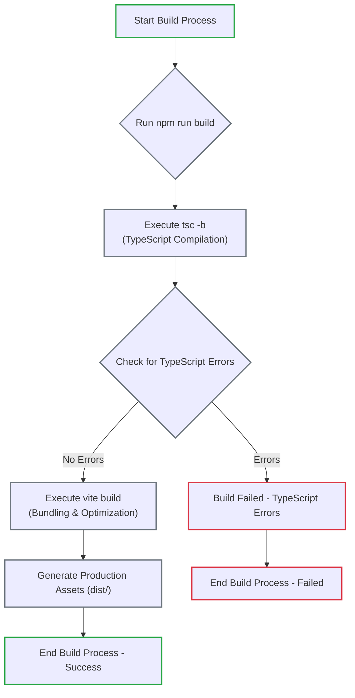

# Personal Portfolio Website

## Table of Contents

- [Project Overview](#-project-overview)
- [Technologies Used](#-technologies-used)
- [Features](#-features)
- [Project Structure](#-project-structure)
- [Getting Started](#-getting-started)
- [Scripts](#-scripts)
- [Testing](#-testing)
- [Deployment](#-deployment)
- [License](#-license)
- [Contributing](#-contributing)
- [Reporting Issues](#-reporting-issues)
- [Contact](#-contact)

## 💡Project Overview

Welcome to my personal portfolio website! This project serves as a dynamic showcase of my skills, projects, and professional journey as a software engineer. Crafted with a focus on modern web development principles, this single-page application (SPA) delivers a seamless, high-performance, and accessible user experience across all devices. It's designed to be a comprehensive representation of my technical abilities and creative solutions.

## 🛠 Technologies Used

This project leverages a robust stack of modern web technologies to deliver a high-quality, maintainable, and scalable application:

### Frontend Development

- **React**: A declarative, component-based JavaScript library for building user interfaces.
- **TypeScript**: A typed superset of JavaScript that compiles to plain JavaScript, enhancing code quality and developer productivity.

### Styling

- **Tailwind CSS**: A utility-first CSS framework for rapidly building custom designs directly in your markup.
- **React Icons**: A collection of popular icon libraries, integrated for easy use within React projects.

### Build & Tooling

- **Vite**: A next-generation frontend tooling that provides an extremely fast development experience with features like instant server start and lightning-fast Hot Module Replacement (HMR).
- **ESLint**: A pluggable linting utility for JavaScript and JSX, ensuring code consistency and catching potential errors.

### Testing

- **Vitest**: A fast and modern unit testing framework powered by Vite, offering a familiar API similar to Jest.
- **React Testing Library**: A set of utilities that encourages good testing practices by focusing on testing components the way users interact with them.

## 🚀 Features

This portfolio website is packed with features designed to provide a rich and interactive user experience:

- **Responsive Design**: Ensures a seamless and optimal viewing experience across a wide range of devices, from desktops to mobile phones.

- **Dynamic Project Showcase**: Highlights key projects with dedicated sections, including descriptions, technologies used, and links to live demos or repositories.

- **Comprehensive About Me Section**: Provides insights into my professional background, skills, and personal interests.

- **Interactive Contact Form**: A user-friendly form with real-time validation, helpful placeholders, and a character counter to facilitate easy communication.

- **Skills Showcase**: Clearly presents my technical proficiencies, categorized for easy readability.

- **Smooth Navigation**: Includes a "Back to Top" functionality for improved user experience on longer pages and a scroll spy feature to highlight the active section in the navigation.

## 📦 Project Structure

The project follows a clear and modular structure to ensure maintainability and scalability:

```bash
src/
├── components/       # Reusable UI components
│   ├── common/       # Shared components (e.g., Header, Footer, BackToTop)
│   ├── sections/     # Main page sections (e.g., Hero, About, Projects, Contact, Skill)
│   └── ui/           # Smaller, generic UI elements (e.g., ContactForm, ProjectCard)
├── data/             # Static data and TypeScript type definitions (e.g., personal info, projects, skills)
├── hooks/            # Custom React hooks for reusable logic (e.g., useScrollSpy)
├── styles/           # Global styles and animations (e.g., animations.css)
├── test/             # Unit and integration test files for components and hooks
└── utils/            # Utility functions and constants (e.g., animation helpers, constants)
```

## 🏃‍♂️ Getting Started

1. Clone the repository:

   ```bash
   git clone https://github.com/nutthawootp/nutthawootp.github.io.git
   ```

2. Install dependencies:

   ```bash
   npm install
   ```

3. Start the development server:

   ```bash
   npm run dev
   ```

4. Build for production:

   ```bash
   npm run build
   ```

## 🔧 Scripts

- `npm run dev` - Start development server
- `npm run build` - Build for production
- `npm run lint` - Run ESLint
- `npm run preview` - Preview production build
- `npm test` - Run unit tests
- `npm run coverage` - Run tests with coverage report

## 📊 Build Process

Understanding the project's build process is crucial for development and deployment. Below is a flowchart illustrating the steps involved when you run `npm run build`:



**Explanation of the Build Process:**

- **Start Build Process**:The initiation point for building the application.

- **Run npm run build**: This command triggers the entire production build sequence.

- **Execute tsc -b (TypeScript Compilation)**: The first critical step where all TypeScript source code is compiled into standard JavaScript. This step also performs type checking.

- **Check for TypeScript Errors**: A crucial decision point. If any TypeScript compilation errors are detected, the build process is halted.

- **Execute vite build (Bundling & Optimization)**: If TypeScript compilation is successful (no errors), Vite takes over. This phase involves bundling all JavaScript, CSS, and other assets, optimizing them for production (e.g., minification, tree-shaking, code splitting), and preparing them for deployment.

- **Generate Production Assets (dist/)**: Upon successful completion of the Vite build, all production-ready static files (HTML, CSS, JavaScript, images, etc.) are outputted into the `dist/` directory.

- **End Build Process - Success/Failed**: The final state, signifying whether the entire build operation completed successfully or encountered a failure.

## 🚀 Deployment

This project is configured for continuous deployment to GitHub Pages ([https://nutthawootp.github.io/](https://nutthawootp.github.io/)) using GitHub Actions. Any push to the `main` branch will automatically trigger a build and deployment process.

To manually deploy the application:

1. Ensure you have built the project for production:

    ```bash
    npm run build
    ```

2. The `dist` directory will contain the production-ready static files. You can then deploy these files to your preferred hosting service (e.g., Netlify, Vercel, GitHub Pages).

## 🧪 Testing

The project includes comprehensive unit and integration tests to ensure reliability and maintainability. Tests are written using Vitest and React Testing Library, covering various aspects of the application:

- **Component Rendering**: Verifies that components render correctly with expected props and state.
- **User Interactions**: Simulates user events (e.g., clicks, form submissions) to ensure proper functionality.
- **Responsive Behavior**: Checks how components adapt to different screen sizes.
- **Form Validation**: Ensures that form inputs are validated correctly.
- **Navigation Functionality**: Tests routing and link behaviors.
- **Scroll Behaviors**: Verifies custom scroll-related functionalities (e.g., Back to Top, Scroll Spy).

To run the test suite:

```bash
# Run tests in watch mode
npm test

# Run tests with coverage report
npm run coverage
```

## 📝 License

This project is open source and available under the [MIT License](LICENSE).

## 🤝 Contributing

We welcome contributions to this project! Please see our [Contributing Guidelines](CONTRIBUTING.md) for more details.

## 🐛 Reporting Issues

If you find any bugs or have feature requests, please open an issue using our [Issue Templates](.github/ISSUE_TEMPLATE/).

## 📞 Contact

If you have any questions, suggestions, or just want to connect, feel free to reach out:

[](https://www.linkedin.com/in/nutthawootp)

[](https://github.com/nutthawootp)

Thank you for visiting my portfolio!
